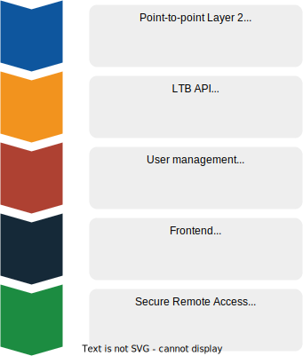

# Lab Topology Builder Documentation

The Lab Topology Builder (LTB) is an open source project that allows users to deploy networking labs on Kubernetes. It is a tool that enables you to build a topology of virtual machines and containers, which are connected to each other according to the network topology you have defined.

To get started, please refer to the [User Guide](user-guide.md).

## Features

- Management of networking labs on Kubernetes
- Status querying of lab deployments
- Remote access to lab nodes' console via web browser
- Remote access to lab nodes' OOB management (e.g. SSH)
- Management of custom node types

## Roadmap

