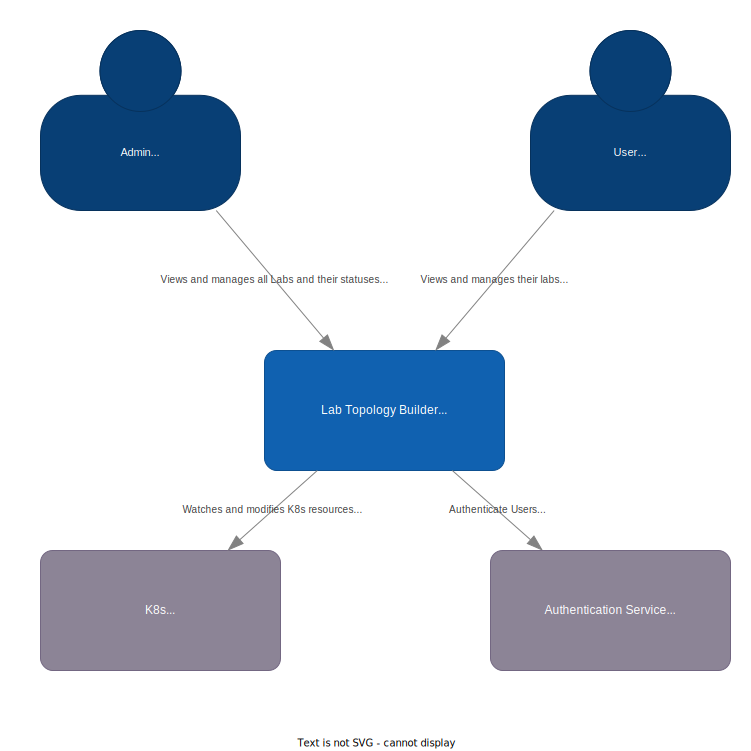
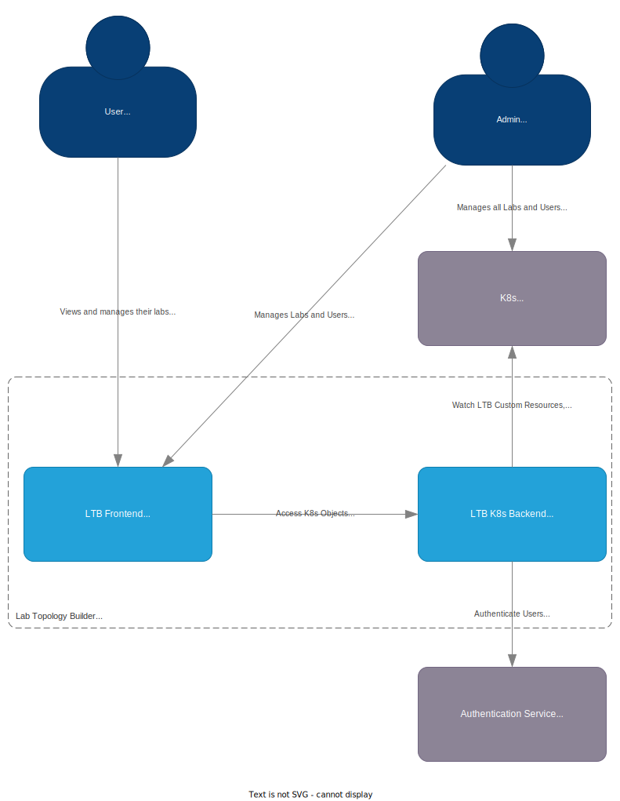

# Kubernetes Lab Topology Builder Architecture

The main components of the Kubernetes based LTB are:

- [Frontend](#frontend)
- [API](#api)
- [Operator](#operator)

The following diagram shows how the components interact with each other:

## Frontend

The frontend can be implemented in any language and framework, it just needs to be able to communicate via a HTTP API with the LTB API.
The frontend is responsible for the following tasks:

- Providing a web UI for the user to interact with the labs.
- Providing a web UI for the admin to manage:
  - Users
  - Lab templates
  - Lab deployments
  - Reservations

There is a possibility to reuse parts of the existing frontend from the KVM/Docker based LTB.

## API

The API is responsible for the following tasks:

- To create, update and delete LTB resources (node types, lab templates, lab instances)
- Exposes status of lab instances
- Expose information on how to access the deployed lab nodes
- Authentication via an external authentication provider

No parts from the existing KVMDocker based LTB can be reused for the API.

### Authentication

The authentication can be implemented by using an external authentication provider like [Keycloak](https://www.keycloak.org/).
Keycloak can be configured to act as a authentication broker with external identity providers like LDAP, OpenID Connect, SAML, etc.
This has the benefit that the LTB does not need to implement any authentication logic and can focus on the lab deployment.
Additionally, it enables the LTB to be integrated into existing authentication infrastructures, with the benefit that users do not need to create a new account.

## Operator

The operator is responsible for the following tasks:

- Deploying/destroying the containers and vms
- Check validity of LTB resources (node types, lab templates, lab instances)
- Enables you to access the deployed containers and vms via different protocols
- Providing remote access to the lab node console via a web terminal
- Managing reservations (create, delete, etc.)
- Providing remote Wireshark capture capabilities

The operator is implemented according to the [Kubernetes operator pattern](https://kubernetes.io/docs/concepts/extend-kubernetes/operator/).
It has multiple controllers that are responsible for managing a particular custom resource like a lab template.

### Network connectivity between lab nodes

The network connectivity between lab nodes can be implemented with [Multus](https://github.com/k8snetworkplumbingwg/multus-cni), which is a "meta-plugin" that enables attaching multiple CNI plugins to a kubernetes pod/vm
Multus uses NetworkAttachmentDefinitions (NAD) to describe, which CNI plugin should be used and how it should be configured.

Currently we use a linux bridge as a secondary CNI plugin, with the drawback that the links between the lab nodes are not pure layer 2 links, but layer 3 links.
Additionally the connection between the lab nodes only work on the same Kubernetes host, because the linux bridge does not implement any kind of cross-host networking.

### Remote access to lab nodes

Remote access to the lab nodes has two variants:

- Console access via a web terminal
- Access to configurable ports with any OOB management protocol

#### Console access via a web terminal

The console access via a web terminal is implemented with [kube-ttyd](https://github.com/INSRapperswil/kube-ttyd), which is a tool based on [ttyd](https://github.com/tsl0922/ttyd), with the addition to use kubectl exec and virsh console to connect to the lab nodes.
`kube-ttyd` was provided by Yannick Zwicker from the INS specifically for this project.
Access to the web terminal is routed through a NGINX ingress controller, and a Kubernetes service of type `ClusterIP`.

The [authentication feature](https://kubernetes.github.io/ingress-nginx/examples/auth/external-auth/) of the NGINX ingress controller can be used to restrict access to the web terminal to authenticated users.
It might be possible to use the same authentication provider as the LTB API, but this needs to be tested.

#### Access to configurable ports with any OOB management protocol

Access to lab nodes via freely choosable OOB management protocols is implemented by providing a Kubernetes service of type `LoadBalancer` for each lab node, which is configured to expose the ports specified in the lab template.

Access control needs to be implemented by the lab node itself, because the Kubernetes service of type `LoadBalancer` does not provide any authentication or authorization features.
An example for this would be to provide SSH keys for the lab nodes inside the lab template config field.

### Scheduling lab instances and resource reservation

A feature to schedule the deployment and deletion of a lab instance to a specific time is not implemented, but could be implemented by adding an additional fields (creationTimestamp, deletionTimestamp) to the lab instance custom resource.
The lab instance controller then is able to check these fields and deploy or delete the lab instance at the specified time.
There multiple ways to implement this, either by regularly checking the lab instance custom resources, or by requeuing the lab instance creation/deletion event to the specified time.

If there are any issues with the requeuing of these events over such a long period of time, writing a Kubernetes [informer](https://pkg.go.dev/k8s.io/client-go/informers) could be a solution.

Resource reservation in a capacity planning sense is not provided by Kubernetes, a manual solution could be implemented by using [limit ranges](https://kubernetes.io/docs/concepts/policy/limit-range/), [resource quotas](https://kubernetes.io/docs/concepts/policy/resource-quotas/) and the Kubernetes node resources.
Planned resource management is a huge topic, and we would recommend to create a dedicated project for this.

## C4 Model

The following diagrams show the C4 model of the Kubernetes based LTB, it should provide a high level overview of the system.

### System Context Diagram

### Container Diagram

### Component Diagram

#### Legend

- Dark blue: represents Personas (User, Admin)
- Blue: represents Internal Components (Frontend Web UI, LTB K8s Backend)
- Light blue: represents Components which will be implemented in this project (LTB Operator, LTB Operator API)
- Dark gray: represents External Components (K8s, Keycloak)
