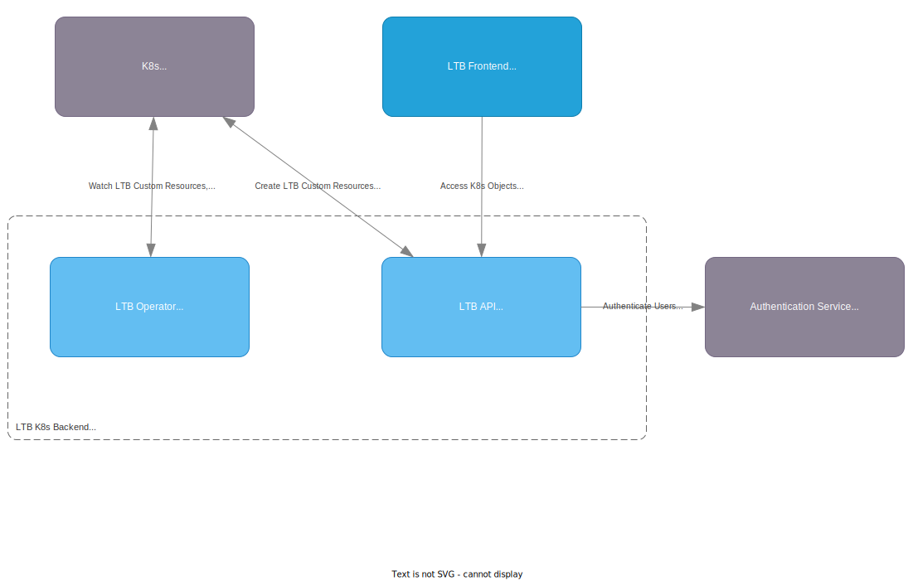

# Kubernetes Lab Topology Builder Architecture

The Kubernetes Lab Topology Builder (K8s-LTB) is a Kubernetes native version of the Lab Topology Builder (LTB).
It is composed of a [Frontend](#frontend) and a [Backend](#backend).

## Frontend

The frontend is responsible for the following tasks:

- Providing a web UI for the user to interact with the labs.
- Providing a web UI for the admin to manage:
  - users
  - lab templates
  - lab deployments
  - reservations

## Backend

The backend is composed of the following components:

- API
- Operator

The backend is responsible for the following tasks:

- parsing the yaml topology files
- deploying/destroying the containers and vms
- exposes status of lab deployments
- exposes information on how to access the deployed containers and vms
- provides remote ssh capabilities
- provides remote Wireshark capture capabilities
- managing reservations (create, delete, etc.)
- exposes node resource usage
- user management
- exposes information about a device (version, groups, etc.)

## C4 Model

### System Context Diagram

### Container Diagram

### Component Diagram

