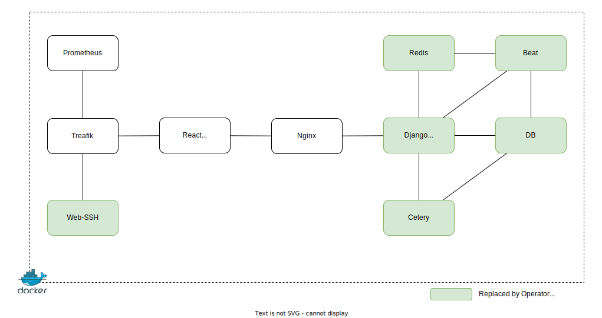

# Preliminary Work KVM/Docker-based LTB Architecture

The Kubernetes based LTB was inspired by a previous implementation of the LTB, which was based on direct KVM and Docker usage.

The following diagram shows the components of the KVM/Docker-based LTB, the lines indicate communication between the components:

Currently the KVM/Docker-based LTB is composed of the following containers:

- [Frontend](#frontend) built with React
- [Backend](#backend) built with Django
- [Databases](#databases) (PostgreSQL, Redis)
- [Beat](#beat)
- [Celery](#celery)
- [Web-SSH](#web-ssh)
- [Prometheus](#prometheus)
- [Traefik](#traefik)
- [Nginx](#nginx)

## Backend

The backend is accessible via API and an Admin Web UI.
It is responsible for the following tasks:

- parsing the yaml topology files
- deploying/destroying the containers and vms
- exposes status of lab deployments
- exposes information on how to access the deployed containers and vms
- provides remote ssh capabilities
- provides remote Wireshark capture capabilities
- managing reservations (create, delete, etc.)
- exposes node resource usage
- user management
- exposes information about a device (version, groups, etc.)

It is composed of the following components:

- [Reservations](#reservations)
- [Running lab store](#running-lab-store)
- [Template store](#template-store)
- [Authentication](#authentication)

The orchestration component is responsible for creating different tasks using Celery and executing them on a remote host.
There are 4 different types of tasks:

- DeploymentTask
  - Deploys containers in docker
  - Deploys VMs using KVM
  - Creates connections between containers and VMs using an OVS bridge
- RemovalTask
  - Removes a running lab
- MirrorInterfaceTask
  - Creates a mirror interface on a connection
- SnapshotTask
  - Takes a snapshot of a running lab

### Reservations

The reservation component is responsible for reserving system resources in advance. It is responsible for the following tasks:

- Create a reservation
- Delete a reservation
- Update a reservation

### Running lab store

This component is responsible for storing information about running labs, such as:

- The devices taking part in the running lab, including the interfaces
- Connection information

### Template store

This component is responsible for storing lab templates.

### Authentication

This component is responsible for user authentication and management.

## Databases

The following databases are used:

- PostgreSQL
- Redis for caching

The Databases are used by the following components:

- Backend
- Beat
- Celery

## Beat

The beat component is responsible for scheduling periodic tasks.
To be more precise, it is responsible for scheduling the deployment and deletion of labs, according to the reservation information.

## Celery

Celery is used to execute the commands to create and delete the lab nodes and connections.

## Web-SSH

Web-SSH is used to provide a web based ssh client, which can be used to access the deployed containers and vms aka lab nodes.

## Prometheus

Prometheus is used to collect metrics about CPU, memory and disk usage of the hypervisor nodes.

## Traefik

Traefik is used as a proxy for the following components:

- Frontend
- Web-SSH
- Prometheus
- Nginx

## Nginx

Nginx is used as a reverse proxy for the backend.

## Frontend

The frontend provides a web UI with the following features:

- User authentication
- Management of lab templates
- Management of reservations for labs
- Start/stop running labs
- Resource usage overview
- Provides information on how to access the deployed containers and vms
- Create wireshark capture interfaces
