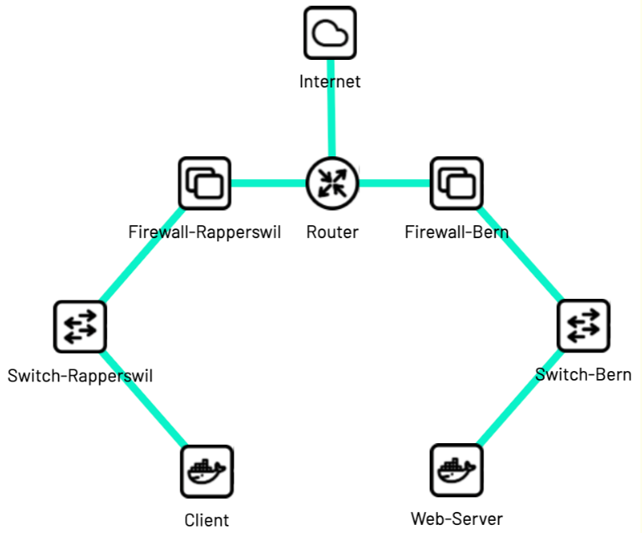

# Concepts

## Lab Topology Builder

The Lab Topology Builder is a network emulator that allows you to build a topology of virtual machines and containers, which are connected to each other according to the network topology you have defined.

## Network Topology

The arrangement or pattern in which all nodes on a network are connected together is referred to as the network’s topology.

Here is an example of a network topology:

## Lab

In our context, a lab refers to a networking lab consisting of interconnected nodes following a specific network topology.

## LTB Operator

The LTB Operator is a K8s Operator for the LTB application, which is responsible for creating, configuring, and managing the emulated network topologies of the LTB application inside a Kubernetes cluster.
It also automatically updates the status of the labs based on the current state of the associated containers and virtual machines, ensuring accurate and real-time lab information.

## Lab Template

A `LabTemplate` is a Kubernetes costume resource (CR), that defines a template for a lab. It contains information about which nodes are part of the lab, their configuration, and how they are connected to each other.

## Lab Instance

A `LabInstance` is a custom resource (CR) that describes a specific lab intended for deployment within a Kubernetes cluster.
It has a reference to the `LabTemplate` you want to use and also has a status field that is updated by the LTB Operator. This status field shows how many pods and VMs are running in the lab and the status of the `LabInstance` itself. In addition, it also has a dns address field, that will be used to access the nodes using the web-based terminal.

## Node Type

In a network, a node represents any device that is part of the lab. A `NodeType` is a CR that defines a type of node that can be part of a lab. You reference the `NodeType` you want to have in your lab in the `LabTemplate`.
Within LTB, a node can be either a KubeVirt virtual machine or a regular Kubernetes pod.

## Links

If you would like to familiarize yourself with the Kubernetes concepts mentioned above, please refer to the following links:

- [Kubernetes](https://kubernetes.io/docs/concepts/overview/what-is-kubernetes/)
- [Kubernetes Cluster](https://kubernetes.io/docs/concepts/architecture/cluster-components/)
- [Kubernetes Operator](https://kubernetes.io/docs/concepts/extend-kubernetes/operator/)
- [Custom Resource Definition](https://kubernetes.io/docs/concepts/extend-kubernetes/api-extension/custom-resources/#customresourcedefinitions)
- [Custom Resource](https://kubernetes.io/docs/concepts/extend-kubernetes/api-extension/custom-resources/#custom-controllers)
