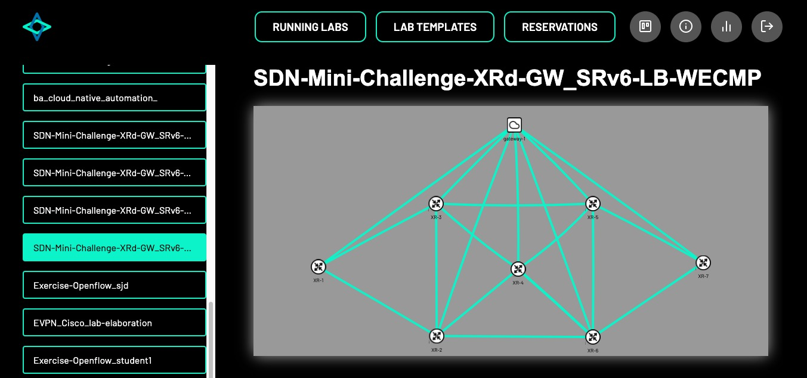

# Concepts

## Lab Topology Builder (LTB)

The Lab Topology Builder (LTB) is a tool that allows you to build a topology of virtual machines and containers, which are connected to each other according to the network topology you have defined.



## LTB Kubernetes Backend

The LTB Kubernetes Backend consists of the LTB Operator and the LTB Operator API, which replaces the current KVM/Docker-based backend of LTB. It is responsible for managing the lab instances in a Kubernetes cluster and provide a REST API for the frontend to interact with the kubernetes cluster.

## Kubernetes Cluster

Kubernetes Cluster is a set of nodes that run containerized applications managed by Kubernetes. A Kubernetes cluster consists of a control plane and one or more nodes. The control plane is responsible for maintaining the desired state of the cluster, such as which applications are running and which container images they use, etc. And the nodes run the applications and workloads.

## Kubernetes operator

A Kubernetes operator is an application-specific controller that extends the functionality of the Kubernetes API to create, configure, and manage instances of complex applications on behalf of a Kubernetes user.
It builds upon the basic Kubernetes resource and controller concepts but includes domain or application-specific knowledge to automate the entire life cycle of the software it manages.

### LTB Kubernetes Operator

The LTB Kubernetes Operator is a K8s Operator for the LTB application, which manages lab templates, lab instances in a Kubernetes cluster. It manages lab instances, node types, etc. It also updates the status of the lab instances according to the current state of the containers and virtual machines that are part of the lab instance.

## Custom Resource Definition (CRD)

A [custom resource definition](https://kubernetes.io/docs/concepts/extend-kubernetes/api-extension/custom-resources/#customresourcedefinitions) (CRD) is a Kubernetes native resource.
Defining a CRD object creates a new custom resource with a name and schema that you specify.
The custom resource created from a CRD object can be either namespaced or cluster-scoped.
CustomResourceDefinitions themselves are non-namespaced and are available to all namespaces.

<!-- TODO Maybe move to contributor section -->
The following example shows a CRD for a LabInstance object, how they are defined in go and how the YAML output looks like.

```go
import (
 metav1 "k8s.io/apimachinery/pkg/apis/meta/v1"
)

type LabInstanceSpec struct {
 LabTemplateReference string `json:"labTemplateReference"`
}

type LabInstanceStatus struct {
 Status         string `json:"status,omitempty"`
 NumPodsRunning string `json:"numpodsrunning,omitempty"`
 NumVMsRunning  string `json:"numvmsrunning,omitempty"`
}

//+kubebuilder:object:root=true
//+kubebuilder:subresource:status
//+kubebuilder:printcolumn:name="STATUS",type=string,JSONPath=`.status.status`
//+kubebuilder:printcolumn:name="PODS_RUNNING",type=string,JSONPath=`.status.numpodsrunning`
//+kubebuilder:printcolumn:name="VMS_RUNNING",type=string,JSONPath=`.status.numvmsrunning`

type LabInstance struct {
 metav1.TypeMeta   `json:",inline"`
 metav1.ObjectMeta `json:"metadata,omitempty"`

 Spec   LabInstanceSpec   `json:"spec,omitempty"`
 Status LabInstanceStatus `json:"status,omitempty"`
}

// +kubebuilder:object:root=true
type LabInstanceList struct {
 metav1.TypeMeta `json:",inline"`
 metav1.ListMeta `json:"metadata,omitempty"`
 Items           []LabInstance `json:"items"`
}
```

```yaml
---
apiVersion: apiextensions.k8s.io/v1
kind: CustomResourceDefinition
metadata:
  annotations:
    controller-gen.kubebuilder.io/version: v0.10.0
  creationTimestamp: null
  name: labinstances.ltb-backend.ltb
spec:
  group: ltb-backend.ltb
  names:
    kind: LabInstance
    listKind: LabInstanceList
    plural: labinstances
    singular: labinstance
  scope: Namespaced
  versions:
  - additionalPrinterColumns:
    - jsonPath: .status.status
      name: STATUS
      type: string
    - jsonPath: .status.numpodsrunning
      name: PODS_RUNNING
      type: string
    - jsonPath: .status.numvmsrunning
      name: VMS_RUNNING
      type: string
    name: v1alpha1
    schema:
      openAPIV3Schema:
        properties:
          apiVersion:
            description: 'APIVersion defines the versioned schema of this representation
              of an object. Servers should convert recognized schemas to the latest
              internal value, and may reject unrecognized values. More info: https://git.k8s.io/community/contributors/devel/sig-architecture/api-conventions.md#resources'
            type: string
          kind:
            description: 'Kind is a string value representing the REST resource this
              object represents. Servers may infer this from the endpoint the client
              submits requests to. Cannot be updated. In CamelCase. More info: https://git.k8s.io/community/contributors/devel/sig-architecture/api-conventions.md#types-kinds'
            type: string
          metadata:
            type: object
          spec:
            properties:
              labTemplateReference:
                type: string
            required:
            - labTemplateReference
            type: object
          status:
            properties:
              numpodsrunning:
                type: string
              numvmsrunning:
                type: string
              status:
                type: string
            type: object
        type: object
    served: true
    storage: true
    subresources:
      status: {}
```

## Custom Resource (CR)

A [custom resource](https://kubernetes.io/docs/concepts/extend-kubernetes/api-extension/custom-resources/#custom-controllers) (CR) is an extension of the Kubernetes API that allows you to define and manage your own API objects.
It provides a way to store and retrieve structured data and can be used with a custom controller to provide a declarative API.
Custom resources can be defined as a Kubernetes API extension using Custom Resource Definitions (CRDs) or via API aggregation.

## Lab Template

Lab Template is a CR, which defines a template for a lab. It contains information about the lab you want to deploy and a reference to the node types that are part of the lab.

The following YAML is an example of a LabTemplate:

<!-- TODO Remove and add link to example in user guide -->
```yaml
apiVersion: ltb-backend.ltb/v1alpha1
kind: LabTemplate
metadata:
  labels:
    app.kubernetes.io/name: labtemplate
    app.kubernetes.io/instance: labtemplate-sample
    app.kubernetes.io/part-of: operator
    app.kubernetes.io/managed-by: kustomize
    app.kubernetes.io/created-by: operator
  name: labtemplate-sample
spec:
  nodes:
  - name: "sample-node-1"
    image:
      type: "ubuntu"
      version: "22.04"
      kind: "vm"
    config: |-
              #cloud-config
              password: ubuntu
              chpasswd: { expire: False }
              ssh_authorized_keys:
                - <your-ssh-pub-key>
              packages:
                - qemu-guest-agent
              runcmd:
                - [ systemctl, start, qemu-guest-agent ]
  - name: "sample-node-2"
    image:
      type: "ghcr.io/insrapperswil/network-ninja"
      version: "latest"
  - name: "sample-node-3"
    image:
      type: "ubuntu"
      version: "latest"
      kind: "pod"
  connections:
  - neighbors: "TestHost1:1,TestHost2:1"
  port: 22
```

## Lab Instance

A lab instance is a CR that describes a lab that you want to deploy in a Kubernetes cluster.
It has a reference to the lab template you want to use and also has a status field that is updated by the operator, which shows how many pods and VMs are running in the lab and the status of the lab instance itself.

The following YAML is an example of a LabInstance:

<!-- TODO Remove and add link to example in user guide -->
```yaml
apiVersion: ltb-backend.ltb/v1alpha1
kind: LabInstance
metadata:
  labels:
    app.kubernetes.io/name: labinstance
    app.kubernetes.io/instance: labinstance-sample
    app.kubernetes.io/part-of: operator
    app.kubernetes.io/managed-by: kustomize
    app.kubernetes.io/created-by: operator
  name: labinstance-sample
spec:
  labTemplateReference: "labtemplate-sample"
```

## Lab

A deployment of a lab instance is called a lab.

## NodeType

In a network, a node represents any device that is part of the lab. A NodeType is a CR that defines a type of node that can be part of a lab. You reference the node type you want to have in your lab in the lab template.
Within LTB, a node can be either a KubeVirt virtual machine or a pod.

<!--TODO: Link to an example of a node type in user guide-->

## Network Topology

The arrangement or pattern in which all nodes on a network are connected together is referred to as the network’s topology.
